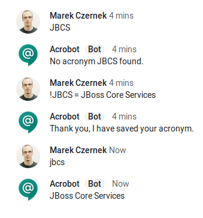
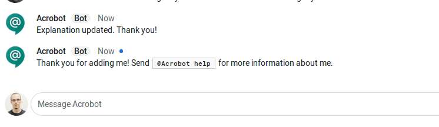

# Acrobot

Acrobot is a Google Hangouts chat bot, with the aim of keeping track
of acronyms within the company.

## Usage

Acrobot is capable of multiple actions:

* Saving acronym: `!acronym = explanation`
* Getting an acronym explanation: `acronym`
* Modifying acronym explanation: `!acronym = explanation => new explanation`
* Removing acronym explanation: `!acronym = explanation =>`

White spaces do not matter. If you are interacting with acrobot in a room,
do not forget to tag the bot, e.g. `@Acrobot !acronym = explanation`.

You can change and remove only those explanations that you entered into the
database.

## Architecture

Acrobot is a simple application, using:

* Java (tested against OpenJDK 1.8 and OpenJDK 11)
* Hibernate
* MySQL
* Kubernetes/OpenShift for deployment #todo OCP template

This particular implementation uses Google's [Cloud Pub/Sub](https://cloud.google.com/pubsub/docs/overview)
messaging middleware.

custom_mark10
@startuml;
actor "Google Hangouts" as User;
participant "Pub/Sub middleware" as A;
participant Acrobot;
User -> A: Send a message;
Acrobot --> A: Poll for a message;
Acrobot --> User: Send a response;
@enduml;
custom_mark10

As such, before deploying the Google bot, you have to complete Google's
Pub/Sub prerequisites:

1. Create a project in the Cloud Platform Console, which:
    1. Has the **Pub/Sub API** enabled.
    1. Has granted the Pub/Sub permissions to the **chat-api-push@system.gserviceaccount.com** service role.
1. Create a service account with the **Pub/Sub API** roles.
1. Create a message queue in the Cloud Platform Console.
1. Associate the queue with a subscription in the Cloud Platform Console.

For more details on setting up the bot, see the [Google Developer's documentation](https://developers.google.com/hangouts/chat/how-tos/pub-sub).

Acrobot has a few dependencies:

1. export **GOOGLE_APPLICATION_CREDENTIALS**: an environment variable that contains the path to the service account json
you created. If you are deploying Acrobot on Kubernetes/OpenShift, you will have to inject the file either using a secret, or a config map, into your pod.
1. export **JDBC_URL**, **JDBC_USER**, and **JDBC_PASSWORD** for the DB connection details.
1. export **PROJECT_ID** and **SUBSCRIPTION_ID** which match your Google project and subscription created earlier.

## Credits

Author: Marek Czernek.
The idea of Acrobot came from a number of very smart folks at Red Hat. The IRC implementation was done by https://github.com/mfojtik. If you wish to run AcroBot on IRC, see the [AcroBot Implementation](https://github.com/theacrobot/AcroBot).
